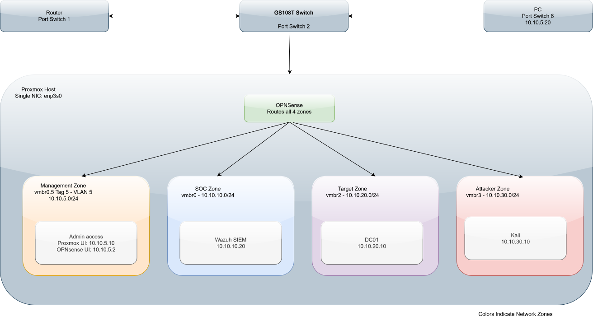
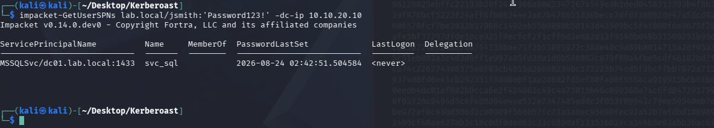
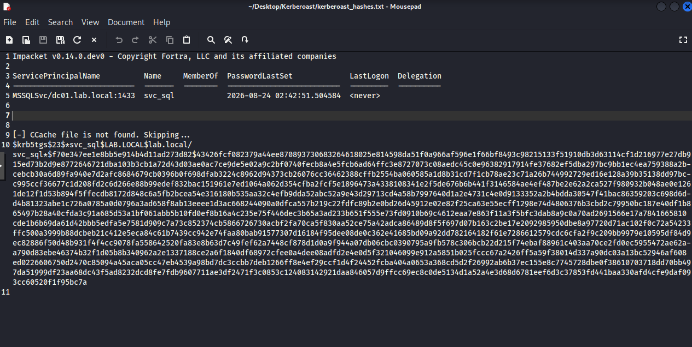
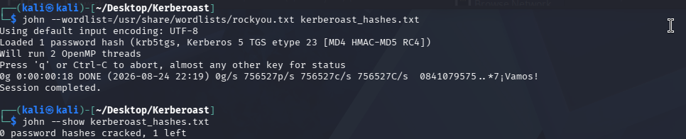
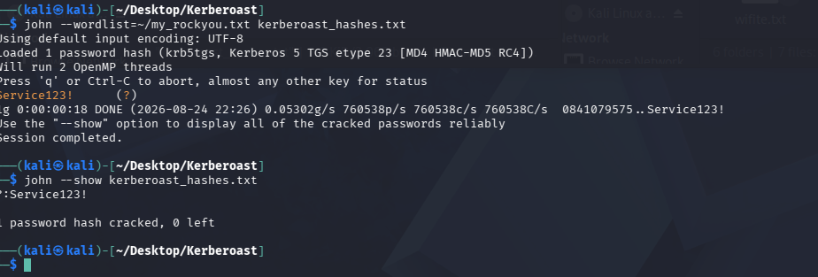
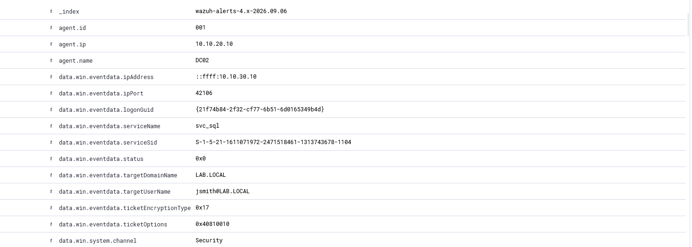

## Summary
---
This project aims to demonstrate a Kerberoasting attack simulation and the detection in a self-hosted SOC environment. The attack implements a forged Kerberos ticket (ATT&CK T1558.003) and utilizes tools like Impacket, JohntheRipper, Wazuh and OPNsense.
## Lab Architecture
---

#### Network Architecture Diagram:
---



#### VLAN Zones Table:
---

| Zone     | Bridge  | VLAN               | Subnet        | Purpose                    |
| -------- | ------- | ------------------ | ------------- | -------------------------- |
| MGMT     | vmbr0.5 | 5                  | 10.10.5.0/24  | Proxmox mgmt. OPNsense LAN |
| SOC      | vmbr0   | 10                 | 10.10.10.0/24 | Wazuh SIEM                 |
| Targets  | vmbr2   | - (private bridge) | 10.10.20.0/24 | DC01                       |
| Attacker | vmbr3   | - (private bridge) | 10.10.30.0/24 | Kali                       |

#### VLAN Roles Table:
---

| Name     | Role                       | Zone         | IP          | OS                  | Key Software                  |
| -------- | -------------------------- | ------------ | ----------- | ------------------- | ----------------------------- |
| OPNsense | Firewall/Router            | All (Routes) | 10.10.5.2   | OPNsense (FreeBSD)  |                               |
| Wazuh    | SIEM                       | SOC          | 10.10.10.20 | Ubuntu              | Wazuh 4.14.5                  |
| DC01     | Domain Controller / Target | Targets      | 10.10.20.10 | Windows Server 2022 | Sysmon, Event Viewer          |
| Kali     | Attacker                   | Attacker     | 10.10.30.10 | Kali Linux          | Impacket, JohnTheRipper, nmap |

## Threat Model / Scenario
---
This lab simulates a post-compromise scenario and not an initial access. We are assuming that an attacker has already obtained low-privileged domain credentials either through phishing, credential stuffing, or a leaked password. With these credentials the attacker is operating as an authenticated but unprivileged user inside the `lab.local` domain. While the initial access itself is out of focus, the focus here is what happens after a foothold is established.

The attacker's goal is simple, privilege escalation through lateral movement. This requires identification of a higher-value target inside the domain and obtaining its credentials without triggering alarms. To do this, Kerberoasting (MITRE ATT&CK T1558.003) is a well-suited technique for this as it doesn't require any exploit, malware or elevated access. This attack abuses a legitimate Kerberos feature (service ticket requests) that any authenticated domain user is entitled to make.

**Attacker starting position:** `jsmith`, a standard domain user account with no special privileges, authenticated on the `lab.local` domain from a Kali Linux attack host.

**Target:** `svc_sql`, a service account with a registered SPN (`MSSQLSvc/dc01.lab.local:1433`), representing the common real-world pattern of service accounts with excessive privilege and weak, rarely rotated passwords.

**Defender Visibility:** DC01 is instrumented with Sysmon and a Wazuh agent, forwarding Windows Security Event Logs, including Event ID 4769 (Kerberos Service Ticket Request), to a centralized Wazuh SIEM for detection

## Attack Walkthrough
---
### Step 1: SPN Enumeration

With a foothold as the low-privileged domain user `jsmith`, the first step is identifying accounts with registered Service Principal Names (SPNs). These are the accounts eligible for Kerberoasting since any authenticated user can request a service ticket for them.

`impacket-GetUserSPNs lab.local/jsmith:'<password>' -dc-ip 10.10.20.10`

This returned `svc_sql`, with SPN `MSSQLSvc/dc01.lab.local:1433`. This is indicative of a service accounts tied to a database engine with broader privileges than a typical user, and its password is rarely rotated.



Note: Kali's clock must be synced to DC01 via  `ntpdate` before this step. Kerberos is highly sensitive to clock skew. Anything beyond a few minutes' drift produces a `KRB_AP_ERR_SKEW` error rather than a usable ticket.

### Step 2: Requesting the TGS and Extracting the Hash

Using the `-request` flag, `impacket-GetUserSPNs`requests a full TGS ticket for `svc_sql`'s SPN and extracts it in a crackable format:

`impacket-GetUserSPNs lab.local/jsmith:'<password>' -dc-ip 10.10.20.10 -request > kerberoast_hashes.txt`

The output is a `$krb5tgs$23` hash. The 23 indicates RC4 encryption which is significant both offensively and defensively. RC4 hashes crack far faster than AES-encrypted tickets which is great offensively. Defensively they become the detection signal in section 5. 



### Step 3: Offline Cracking

The extracted hash was tested against John the Ripper. John was used for CPU-native cracking after running into OpenCL compatibility issues with hashcat in this environment.

#### First attempt - rockyou.txt:

`john --wordlist=rockyou.txt kerberoast_hashes.txt`

This failed to crack the password. `svc_sql`'s actual password, `Service123!`, isn't present in the standard rockyou.txt wordlist. This showcases that even a fairly weak-looking password can survive the most common wordlist attack. 



#### Second attempt - custom wordlist:

`john --wordlist=my_rockyou.txt kerberoast_hashes.txt`

This succeeded, cracking the password in seconds. 




## Detection Engineering
---
#### Why This is Detectable:
---
Kerberoasting abuses a legitimate protocol feature which makes it outright un-blockable but it does leave a specific fingerprint. Modern Windows environments default to AES encryption for Kerberos service tickets. When a TGS request comes back encrypted with RC4 (encryption type `0x17`) instead, it's a strong signal that a tool like Impacket requested the ticket with the intention to force a crackable hash. Legitimate application traffic rarely does this in an environment where AES is available.

#### Enabling Visibility:
---
By default, Windows doesn't log Kerberos service ticket operations at the detail needed. This was enabled via `auditpol`:

`auditpol /set /subcategory:"Kerberos Service Ticket Operations" /success:enable`

This ensures Event ID 4769 is generated and avilable for Sysmon/Wazuh to pick up. This event related to when a Kerberos service ticket is requested.

#### Sample Log Event (sanitized)
---
```
Event ID: 4769
Account Name: jsmith@LAB.LOCAL
Service Name: svc_sql
Service ID: LAB\svc_sql
Ticket Encryption Type: 0x17
Ticket Options: 0x40810000
```

#### Custom Wazuh Rule:
---
A two-tier rule was written in `local_rules.xml`: the first tier matches on Event ID 4769 generically, and the second (child) rule escalates specifically when `Ticket Encryption Type` is `0x17`, tagging it with the MITRE technique:

```
<rule id="100100" level="3">
	`<if_sid>60103</if_sid>`
	`<field name="win.eventdata.ticketEncryptionType">0x17</field>`
	`<description>Possible Kerberoasting: RC4 encryption downgrade detected</description>`
	`<mitre>`
		`<id>T1558.003</id>`
	`</mitre>`
`</rule>`
```


The alert dynamically surfaces `ServiceName` and `TargetUserName`, so each firing identifies exactly which account was targeted and by whom. This does not produce a generic "Kerberos event occurred" alert.



#### Detection Timeline:
----

| Event                       | Timestamp | Source               |
| --------------------------- | --------- | -------------------- |
| TGS request sent (Impacket) |  3:14:00  | Kali                 |
| Event ID 4769 Logged        |  3:14:04  | Windows Security Log |
| Wazuh alert generated       |  3:14:10  | Wazuh Manager        |
The ~3 second delta reflects normal Wazuh agent-to-manager forwarding latency. This is not a detection gap as the attack was flagged essentially in real time.


## Key Takeaways / Lessons Learned 
---
#### Detection logic tradeoffs
Alerting on RC4 downgrade specifically (rather than on Event ID 4769 alone) is a deliberate precision choice. This is due to the fact 4769 fires constantly in any AD environment as a normal part of Kerberos operation, so alerting on it generically would flood the SIEM with noise. Narrowing to the encryption-type field turns a high-volume, low-signal event into a high-confidence one. The tradeoff is that a more sophisticated attacker forcing AES-encrypted tickets (slower but possible attack) would evade this specific rule. It is worth noting as a known limitation rather than glossing over it.

#### Infrastructure decisions are part of the story.
Midway through building the lab, VLAN tagging for Targets (`vmbr2`) and Attacker (`vmbr3`) zones ran into persistent issues, and the pragmatic fix was migrating those zones to private, host-internal Proxmox bridges instead. Rather than treat this as a footnote or hide it, it's documented here as a real architectural decision. This is a kind of workaround-under-contratint that happens in production environments too, not just labs.

#### Password cracking is about wordlist fit, not just password strength
`svc_sql`'s password failed to crack against rockyou.txt but fell immediately to a targeted custom wordlist. This is a small but concrete illustration that "not in the biggest public wordlist" isn't the same as "secure"

## Future Work
---
#### Domain-joined client VM
The current lab only includes the domain controller (DC01) as a Windows target. Adding a domain-joined Windows 10/11 client would enable simulating more realistic attack chains. An example is a phishing-style intial foothold on a workstation followed by lateral movement to DC01, rather than assuming domain credentials are already in hand. 

#### Network-layer detection (Suricata/Zeek)
Detection in this project is entirely host/log based (Sysmon + Windows Event Logs to Wazuh). Adding Suricata or Zeek on the network layer would allow detecting Kerberoasting traffic patterns directly on the wire. Both are useful as a redundancy detection layer and as a way to explore detection engineering from a different vantage point than host logging alone. 

#### VLAN 99 WAN passthrough
OPNsense currently handles routing entirely within the lab's private address space. Configuring a dedicated WAN-facing VLAN (99) would let the lab optionally reach the internet through OPNsense directly, useful for scenarios involving C2 simulation or external tool downloads without relying on the Proxmox host's own network path. 

#### Expanding the attack chain
Kerberoasting here is treated as a standalone technique. A natural next step is chaining it with a follow-on technique post-crack. An example is using `svc_sql`'s cracked credentials to demonstrate lateral movement or further privilege escalation, turning this into a multi-stage attack path rather than a single isolated technique.
## Appendix / References:
---
#### MITRE ATT&CK

T1558.003 – Steal or Forge Kerberos Tickets: Kerberoasting

#### Tools and Versions

| Tool          | Version  | Purpose                                |
| ------------- | -------- | -------------------------------------- |
| Impacket      | 0.14.0   | SPN enumeration, TGS extraction        |
| JohntheRipper | 1.9.0    | Offline hash cracking                  |
| Wazuh         | 4.14.5   | SIEM, log ingestion, alerting          |
| Sysmon        | 15.21    | Extended Windows event logging on DC01 |
| OPNsense      | 26.1.7_1 | Firewall/router                        |
| Proxmox VE    | 9.1.5    | Hypervisor                             |

#### Acknowledgements
Built as a self-directed home lab project to pair hands-on offensive technique practice with detection engineering, informed by ongoing CompTIA CySA+ study.
